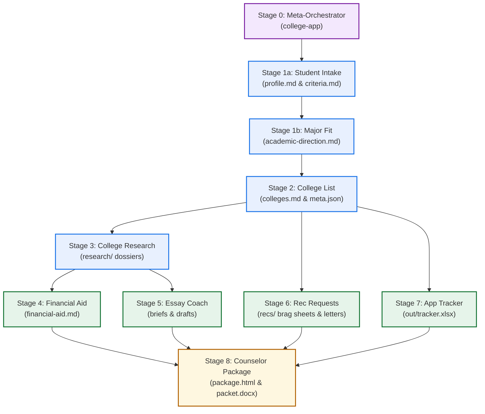

# 10xcolleges

A comprehensive college admissions counseling system built as a Claude plugin. Guides high school students and their families through the entire admissions campaign the way a master college counselor would—from initial intake and major fit to list building, school research, affordability, essay coaching, teacher recommendations, timeline tracking, and counselor review packets.

Plain-spoken, encouraging, honest about admissions odds, and rigorously grounded in official institutional data without ghostwriting or fabrication.

---

## The 8-Stage Counseling Ecosystem

Every stage of the college admissions campaign is powered by a dedicated, canonical skill adhering to the **3-file architecture** (`SKILL.md`, `references/eval.md`, `references/patterns.md`), backed by deterministic validator scripts, formal schema contracts, and multi-turn conduct harness tests:

| Stage | Skill Name | What It Does | Deterministic Validator & Scripts | Formal Schema | E2E Harness Status |
|:---:|---|---|---|---|:---:|
| **0** | **`college-app`** | **Lead Counselor & Meta-Orchestrator:** Discovers workspace, applies "Single Next Step" triage, routes across specialist skills, and executes multi-intent requests. | Coordinates validators, manages `meta.json` | [`schemas/meta.md`](college-apps/schemas/meta.md) | **100% PASS** (`m1-college-app`) |
| **1a** | **`student-intake`** | **Student Record & Criteria Engine:** Gathers student profile, activities, and reflections from conversation or school packets. Captures hard budget filters and deal-breakers. | [`check_record.py`](college-apps/scripts/check_record.py) | [`schemas/profile.md`](college-apps/schemas/profile.md)<br>[`schemas/criteria.md`](college-apps/schemas/criteria.md) | **100% PASS** (`i1-intake-rounds`) |
| **1b** | **`major-fit`** | **Academic Direction & Major Strategy:** Analyzes departmental admit rate disparities, pairs primary majors with adjacent pathways, and audits internal transfer hurdles. | [`check_major.py`](college-apps/scripts/check_major.py) | [`schemas/academic-direction.md`](college-apps/schemas/academic-direction.md) | **100% PASS** (Unit Suite) |
| **2** | **`college-list`** | **Balanced College List Engine:** Formulates balanced 8–12 school lists enforcing the non-negotiable 2-safety floor (both academic and financial under family budget). | [`check_list.py`](college-apps/scripts/check_list.py) | [`schemas/colleges.md`](college-apps/schemas/colleges.md) | **100% PASS** (`l1-list-build`) |
| **3** | **`college-research`** | **Grounded College Dossier Builder:** Gathers verified Common Data Set (CDS §C1, §C9) stats, departmental lab spaces, campus culture, and deadlines into grounded dossiers. | [`check_research.py`](college-apps/scripts/check_research.py) | [`schemas/research.md`](college-apps/schemas/research.md) | **100% PASS** (`r1-research-school`) |
| **4** | **`financial-aid`** | **Affordability & Net Price Engine:** Audits Net Price Calculator (NPC) figures, models need-based and merit aid, and schedules FAFSA and CSS Profile milestones. | [`check_aid.py`](college-apps/scripts/check_aid.py) | [`schemas/financial-aid.md`](college-apps/schemas/financial-aid.md) | **100% PASS** (`f1-financial-aid`) |
| **5** | **`essay-coach`** | **Anti-Ghostwriting Essay Engine:** Guides students through personal statements and supplements: builds prompt rubrics, explores life angles, and provides draft-by-draft feedback. | [`check_draft.py`](college-apps/scripts/check_draft.py) | [`schemas/essay.md`](college-apps/schemas/essay.md) | **100% PASS** (`e3-review-rounds`) |
| **6** | **`rec-request`** | **Teacher Recommendation Engine:** Audits faculty candidates for balanced STEM + Humanities coverage, provides in-person ask scripts, brag sheets with friction moments, and FERPA advice. | [`check_rec.py`](college-apps/scripts/check_rec.py) | [`schemas/recs.md`](college-apps/schemas/recs.md) | **100% PASS** (`k1-rec-request`) |
| **7** | **`app-tracker`** | **Multi-Tier Deadline & Spreadsheet Engine:** Plans backwards schedules with a 7-day server crash buffer, 72-hour portal audit protocol, and generates a live 5-sheet spreadsheet. | [`make_tracker.py`](college-apps/scripts/make_tracker.py) | [`schemas/tracker.md`](college-apps/schemas/tracker.md) | **100% PASS** (Date Suite: 19/19) |
| **8** | **`counselor-package`** | **Counselor Review & Options Packet:** Compiles an interim review package (`package.html` / PDF) opening with 4 high-leverage institutional questions, and fills the official school packet (`packet.docx`). | [`build_package.py`](college-apps/scripts/build_package.py)<br>[`fill_packet.py`](college-apps/scripts/fill_packet.py) | [`schemas/counselor.md`](college-apps/schemas/counselor.md) | **100% PASS** (`p1-counselor-package`) |

---

## System Architecture & Pipeline Flow

The campaign follows a disciplined lifecycle arc where foundational understanding feeds execution, and execution feeds high school counselor advocacy:



---

## Workspace Structure: What You Get

Every student workspace is stored in readable, transparent files you can inspect, edit, or check into Git at any time:

```
students/<name>/
├── profile.md                  # Comprehensive student record with provenance citations
├── criteria.md                 # Hard filters (budget ceiling), preferences, and deal-breakers
├── academic-direction.md       # Primary major, adjacent clusters, and transfer selectivity audit
├── colleges.md                 # 8–12 school list grouped by Tier (Reach/Target/Safety) with rationale
├── meta.json                   # Machine-readable campaign index (colleges, deadlines, recommenders)
├── financial-aid.md            # Net price estimates, FAFSA/CSS status, and scholarship milestones
├── counselor-questions.md      # The 4 high-leverage institutional questions for the school counselor
├── feedback.md                 # Attributed counselor and parent feedback overriding algorithmic data
├── conversations.md            # Verbatim conversational notes capturing authentic student quotes
├── research/                   # Grounded dossiers per college with CDS citations
│   ├── purdue-university.md
│   └── university-of-michigan.md
├── essays/                     # One folder per prompt with briefs, outlines, and numbered drafts
│   └── common-app--personal-statement/
│       ├── brief.md
│       ├── draft-01.md         # Mandatory provenance header (> **STUDENT DRAFT**)
│       └── review-01.md
├── recs/                       # Faculty recommendation assets
│   ├── brag-sheet--alvarez.md  # 3 classroom friction & recovery moments
│   └── request--alvarez.md     # In-person follow-up letter confirming deadlines
└── out/                        # Formatted, derived deliverables
    ├── tracker.xlsx            # 5-sheet operational spreadsheet with countdown formulas
    ├── package.html            # Self-contained review dossier (inlined CSS/SVG, print-ready)
    ├── package.pdf             # Compiled PDF version for the counselor
    └── packet.docx             # Official Senior Post-Secondary Options Questionnaire
```

---

## Core Master Counseling Principles

1. **The "Single Next Step" Principle:** When a student enters without a specific intent, the orchestrator inspects the workspace and recommends exactly one high-impact next action—never overwhelming families with confusing multi-stage menus.
2. **The Non-Negotiable 2-Safety Floor:** A school is a safety only if it is both **academically reliable** ($>50\%$ admit rate, scores above 75th percentile) and **financially viable** (net price verified under the family budget ceiling). An unaffordable school is not a safety.
3. **Affordability is Core Fit:** We prompt for the family budget ceiling early during intake—never postponing financial reality checks until spring award letters.
4. **Anti-Ghostwriting & Academic Integrity:** Colleges require students to affirm their writing is their own. Every draft carries a mandatory author provenance header (`> **STUDENT DRAFT**`). The coach guides, critiques, and scores, but never ghostwrites.
5. **Authentic Adolescent Voice:** Student reflections and packet answers are preserved in authentic adolescent phrasing. Corporate adult consultant polish destroys credibility with school counselors and admissions officers.
6. **Counselor Local Authority Override:** On anything local to the student's high school (Naviance scattergram admit trends, AP course caps, teacher letter queues), the school counselor's advice outranks all AI heuristics and algorithmic tiering.
7. **Strict Anti-Fabrication:** Zero tolerance for hallucinated deadlines, acceptance rates, or student achievements. Every statistic must cite official Common Data Set sections (`[CDS 2024-25 §C1]`) or `.edu` admissions portals.

---

## Installation

### In Claude Cowork

1. Open **Customize** in the sidebar, then **Plugins**.
2. Select **Add marketplace** and enter:
   ```
   tydev-new/10xcolleges
   ```
3. **College Applications** appears in the list. Click **Install**.

The skills load automatically and activate whenever you discuss college planning, essays, research, or deadlines.

### In Claude Code

```bash
/plugin marketplace add tydev-new/10xcolleges
/plugin install college-apps@10xcolleges
```

---

## Testing & Verification

The repository enforces a two-tier verification harness:

1. **Deterministic Unit Test Suite (124/124 Passing):**
   ```bash
   # Run full test suite using project virtualenv
   .venv/bin/python -m unittest discover college-apps/kit/tests
   .venv/bin/python -m unittest discover college-apps/tests
   ```
   - Schema & contract enforcement: `test_data_model.py`, `test_docs.py`
   - Deterministic script validators: `test_check_rec.py`, `test_check_major.py`, `test_check_aid.py`, `test_check_research.py`, `test_check_list.py`, `test_check_record.py`, `test_check_draft.py`
   - Package & document generators: `test_package.py`, `test_fill_packet.py`
   - Date arithmetic & backward planning: `test_dates.py`

2. **Conduct Harness Multi-Turn Simulations (Opus Judge Graded):**
   Multi-turn simulations run in headless sandboxes using real student personas, evaluated by Claude Opus against rigorous MUST / MUST NOT criteria:
   - `m1-college-app`: Meta-orchestrator triage, single next step, multi-intent execution (**100% PASS**)
   - `i1-intake-rounds`: Multi-turn conversational intake and packet onboarding (**100% PASS**)
   - `l1-list-build`: 8–12 school list formulation and 2-safety floor verification (**100% PASS**)
   - `r1-research-school`: Grounded research dossier compilation with CDS citations (**100% PASS**)
   - `f1-financial-aid`: NPC calculation and affordability audit (**100% PASS**)
   - `e3-review-rounds`: Scored prompt rubric, multi-round essay feedback, blind cold reader (**100% PASS**)
   - `k1-rec-request`: Recommender audit, in-person ask script, brag sheet friction moments (**100% PASS**)
   - `p1-counselor-package`: Review dossier compilation and counselor authority override (**100% PASS**)

---

## Documentation Links

- **System Architecture & Data Contracts:** [`college-apps/docs/data-model.md`](college-apps/docs/data-model.md)
- **Counselor Voice & Persona Guidelines:** [`college-apps/docs/voice.md`](college-apps/docs/voice.md)
- **Citation & Provenance Standards:** [`college-apps/docs/citations.md`](college-apps/docs/citations.md)
- **Detailed Development Walkthrough:** [`walkthrough.md`](file:///Users/yongtian/.gemini/antigravity/brain/d3632ce4-1c13-4e6e-b0d2-735956113efd/walkthrough.md)

---

## License

MIT — see [LICENSE](LICENSE).
