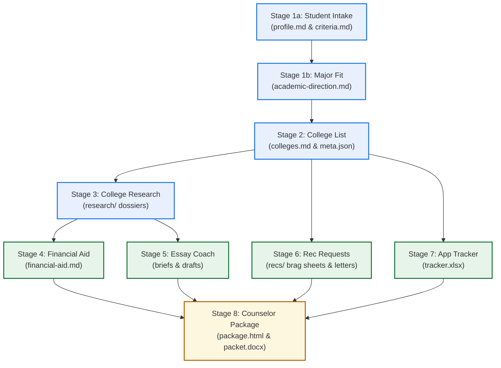

# Master Counseling Patterns: Meta-Orchestration & Lifecycle Management

This document details the operational protocols, triage algorithms, and conversational orchestration strategies used by master college counselors to guide students across the entire multi-month admissions campaign.

---

## Pattern 1: The "Single Next Step" Principle

College admissions is infamous for causing cognitive overload. When a high school senior sits down with a counselor and hears:
> *"We need to finish your profile, research 12 schools, compare net price calculators, draft your Common App essay, ask two teachers for letters, build a tracker, and fill out your counselor packet,"*

the student experiences immediate anxiety and paralysis.

### The Master Counselor Rule:
**Never present a 7-stage menu of options.** Instead, perform internal triage and recommend **exactly one clear, actionable next step**:
- If `profile.md` is full of `TODO:`s $\to$ *"Let's spend 10 minutes finishing your senior coursework and activities so we have a clean foundation."*
- If the student has 10 reach schools and zero safeties $\to$ *"Your reach list looks exciting, but we need two solid safeties before we write essays. Let's find two great schools that fit your budget and admit rate."*
- If the list is balanced but essays are untouched in September $\to$ *"Your list is locked in. Let's look at the Common App essay prompts and find a story that sounds like you."*

---

## Pattern 2: The Holistic Lifecycle Arc & Stage Dependencies

The 8 stages of the college application campaign follow a strict dependency order. Skipping ahead produces degraded work:



### Key Dependencies:
1. **Intake before List:** Building a college list before understanding GPA, testing, and family budget produces an arbitrary rankings printout.
2. **Major Fit before Research:** Researching department lab facilities requires knowing whether the student is aiming for Mechanical Engineering vs. Applied Mathematics.
3. **Research before Essays:** Writing a "Why Us" supplemental essay before conducting thorough research results in generic brochure buzzwords (*"great campus culture and esteemed faculty"*).
4. **Parallel Execution (Autumn):** Once the list and research dossiers are established, Stages 4–7 run in parallel cycles leading into the counselor review package (Stage 8).

---

## Pattern 3: The Multi-Intent Atomic Turn (Dependency-First Execution)

Students rarely speak in single-purpose commands. In real conversations, they volunteer new personal facts while simultaneously demanding complex downstream actions:
- *"I just got a 1440 on my August SAT, can we rebalance my list and see if Georgia Tech is still a reach?"*
- *"Add UIUC for Mechanical Engineering, and tell me what the net price is for an in-state student."*

### The 3-Phase Execution Invariant:
Never bounce the user by saying *"Please update your intake first and ask me again next turn."* Execute the entire dependency chain in a single turn:

```
┌────────────────────────────────────────────────────────────────────────┐
│               THE 3-PHASE MULTI-INTENT EXECUTION PATTERN               │
│                                                                        │
│  Phase 1: Ingest Facts First (The Foundation)                          │
│     • Update profile.md or criteria.md with source tags                │
│     • Append raw student quotes to conversations.md                    │
│                                                                        │
│  Phase 2: Execute Downstream Specialist Analysis                       │
│     • Run college-list / college-research / financial-aid              │
│     • Compute tiering or net price using freshly updated facts         │
│     • Synchronize meta.json with colleges.md                           │
│                                                                        │
│  Phase 3: Run Deterministic Validation As Final Step                   │
│     • Run check_*.py or make_tracker.py                                │
│     • Verify zero syntax errors or schema violations                   │
└────────────────────────────────────────────────────────────────────────┘
```

---

## Pattern 4: The 2-Safety Floor Invariant (Academic + Financial)

A list without safeties is not an application strategy; it is a lottery ticket.

### The Master Counselor Definition of a Safety:
A school is a true safety **only when it satisfies both criteria**:
1. **Academic Safety:** The student's GPA and standardized test scores are comfortably above the college's 75th percentile (middle 50% upper bound), with an overall admit rate $>50\%$.
2. **Financial Safety:** The net price (sticker price minus guaranteed merit or need-based aid verified via Net Price Calculator) is **at or below the family's budget ceiling** without assuming unearned competitive scholarships.

> [!WARNING]
> An institution that is academically safe but costs \$75,000/year for a family with a \$30,000/year budget is **not a safety**. It is a financial rejection waiting to happen in April. Master counselors state this truth clearly and kindly to families before application fees are paid.

---

## Pattern 5: The Single Source of Truth Synchronization Loop

In the 10xColleges architecture:
- `colleges.md` is the **human-readable narrative document**.
- `meta.json` is the **centralized machine-readable index**.
- `out/tracker.xlsx` is the **derived operational spreadsheet**.

### The Synchronization Rule:
Whenever a college is added, removed, re-tiered, or rescheduled:
1. Update `colleges.md` with detailed reasoning and citation vintage.
2. Concurrently update `meta.json` (updating `colleges[]`, `tier`, `decision_plan`, `deadline`, and `app_type`).
3. Re-run `python3 scripts/make_tracker.py students/<slug>` to keep the live spreadsheet in lockstep.

Never permit `meta.json` to drift from `colleges.md`.

---

## Pattern 6: Conversational Memory & Raw Quoting Protocol

When students share anecdotes, observations, or reflections:
> *"I loved Ms. Alvarez's physics class because she let us build that weird pendulum release clamp, but I hated chemistry because it felt like memorizing flashcards."*

### Why Paraphrasing Destroys Value:
If an agent paraphrases this into:
> *"Jordan prefers hands-on applied physical science over theoretical memorization,"*

the authentic adolescent texture is destroyed. Weeks later, when the student drafts their Common App personal statement or the counselor fills out the Secondary School Report packet, the sanitized paraphrase is useless.

### The Invariant:
Always record the student's **exact words in quotation marks** in `conversations.md` with source attribution (`[student YYYY-MM-DD]`). These verbatim notes become the direct ammunition for essay anecdotes and counselor recommendation letters.

---

## Pattern 7: High-Stakes Ambiguity & Ethical Counseling

Students frequently ask questions with high emotional and financial stakes that lack simple algorithmic answers:
- *"Should I apply Early Decision to NYU if my family isn't sure we can afford it?"*
- *"Should I disclose my anxiety diagnosis in my Common App personal statement?"*
- *"Should I report my 10th-grade in-school suspension?"*

### The Ethical Counseling Standard:
1. **Never make a binding unilateral declaration:** Do not give a flippant "yes" or "no."
2. **Lay out the tradeoffs clearly:**
   - *Example (ED without budget certainty):* Explain that Early Decision is a binding contract requiring attendance if admitted, and breaking it requires proving financial impossibility via the financial aid office.
   - *Example (Disability / Mental health disclosure):* Explain that admissions readers look for academic readiness and resilience; unless a condition explains a transcript dip and is paired with sustained recovery, it is usually better framed neutrally in the Additional Information section or counselor letter rather than the personal statement.
3. **Point to the School Counselor:** For institutional reporting, district transcript policies, or delicate family circumstances, advise the student to consult their school counselor, who serves as the official institutional advocate.

---

## Pattern 8: Anti-Fabrication & Strict Citation Enforcement

In college admissions, an incorrect deadline means a rejected application, and an unsourced statistic destroys counselor and admissions reader credibility.

### Non-Negotiable Standards:
1. **No Invented Deadlines:** Deadlines must be verified against official college admissions domains (`.edu`), never guessed.
2. **No Fabricated Statistics:** Admit rates and middle 50% test percentiles must cite official Common Data Set (CDS) sections (`§C1`, `§C9`) or IPEDS data with year vintage.
3. **No Phantom Accomplishments:** Never invent activities, leadership titles, or awards in `profile.md` or essays. If a section lacks details, mark it honestly with `TODO:`.
4. **Strict Citation Formats:** Every fact in `profile.md`, `criteria.md`, and `research/` must include its provenance tag (`[transcript]`, `[student YYYY-MM-DD]`, `[CDS 2024-25]`, `[case.edu]`).
